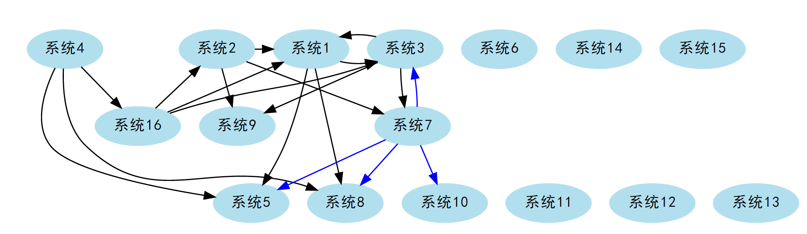
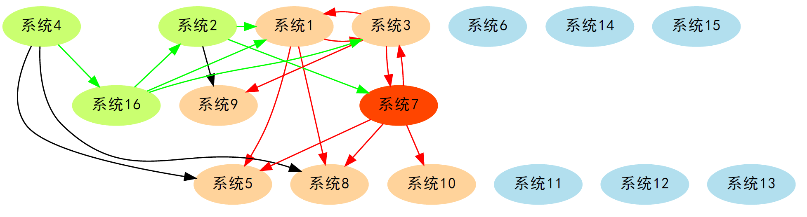
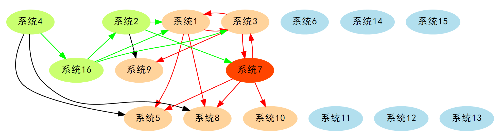
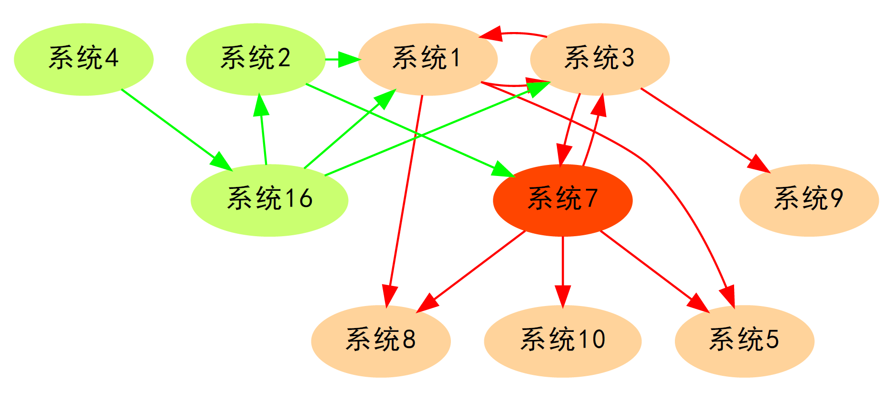

# app_relation_net_graph
根据 Excel 数据生成应用的关系网络图，可以将系统之间的调用关系、接口之间的调用关系用网络图的方式展示出来，并且可以将指定系统或接口的上下游用特殊标记展示出来，便于快速分析影响系统。

同理，利用这个工具也可以生成数据方面的 ETL 血缘关系。

## 安装（windows）

1、安装 Python 3，具体步骤可以直接百度；

2、安装 graphviz 主体软件：

Graphviz 官网地址：https://graphviz.org/

Graphviz 的官网安装包下载：https://graphviz.gitlab.io/_pages/Download/Download_windows.html

解压下载的压缩包，然后将该目录配置到 path 环境变量，然后执行以下命令验证是否安装成功：

```
dot -version
```

3、安装 HiveNetLib：

完整安装，将所有依赖包一并安装的模式（推荐）：

```
pip install HiveNetLib
```

HiveNetLib也支持暂不安装相应的依赖包，待第一次运行再拉取相应的包，使用以下命令：

```
pip install --no-deps HiveNetLib
```

4、pip 安装 graphviz，执行以下命令：

```
pip install graphviz
或
pip install -i https://mirrors.aliyun.com/pypi/simple/ graphviz
```

技术文档：https://graphviz.readthedocs.io/en/stable/

5、安装当前包：

```
pip install app_relation_net_graph
```


## 使用

**1、准备你要生成图的数据文件**

文件为excel格式，文件包含标题行, 标题命名和具体内容要求如下:

- id - 系统或模块的唯一标识
- name - 可选, 系统或模块的显示名称
- rank - 可选, 系统或模块归集为一个组的组名, 同一个组的图示在同一行显示
- 关系名1 - 与当前系统具有指定关系的系统清单, 多个系统间用','分隔, 系统使用id或name都可以, 匹配规则是优先使用ID匹配

**注意：按列可以列举多个关系**

例如unit_test目录下的test.xlsx，call 和 batch为与同一行系统的调用关系：

| name   | rank | id   | call         | batch            |
| ------ | ---- | ---- | ------------ | ---------------- |
| 系统1  | a    | S1   | S3,S5,S8     |                  |
| 系统2  | a    | S2   | S1,S7,S9     |                  |
| 系统3  | a    | S3   | S1,S7,S9     |                  |
| 系统4  | a    | S4   | S5,系统8,S16 |                  |
| 系统5  |      | S5   |              |                  |
| 系统6  |      | S6   |              |                  |
| 系统7  |      | S7   |              | S3,S5,S8, 系统10 |
| 系统8  |      | S8   |              |                  |
| 系统9  |      | S9   |              |                  |
| 系统10 | b    | S10  |              |                  |
| 系统11 | b    | S11  |              |                  |
| 系统12 | b    | S12  |              |                  |
| 系统13 | b    | S13  |              |                  |
| 系统14 |      | S14  |              |                  |
| 系统15 |      | S15  |              |                  |
| 系统16 |      | S16  | S1,S2,系统3  |                  |

**2、进入控制台**

在命令行输入 “appnet” 进入控制台，该模式可以支持输入提示，如果要查看支持的命令，请在控制台输入：

```
appnet/> help
help           提供 app_relation_net_graph 控制台命令的帮助信息
exit           退出 app_relation_net_graph 控制台
pwd            显示当前工作目录
setlanguage    Change language
cd             修改当前工作目录
syscmd         执行操作系统自有命令
graph          生成应用关系网络图
```

如果需要查看生成关系网络图的命令帮助，输入：

```
appnet/> help graph
生成应用关系网络图

graph file [formatter=...] ...
    file : 要生成网络图的文件
    formatter : 导入文件格式化类型, 支持格式化类型如下:
        col-list - excel格式列清单模式, 文件包含标题行, 标题命名和具体内容要求如下:
            id - 系统或模块的唯一标识
            name - 可选, 系统或模块的显示名称
            rank - 可选, 系统或模块归集为一个组的组名, 同一个组的图示在同一行显示
            关系名1 - 与当前系统具有指定关系的系统清单, 多个系统间用','分隔, 系统使用id或name都可以, 匹配规则是优先使用ID匹配
            ... - 按行可以列举多个关系
    comment : 关系图的描述内容
    direction : 关系箭头方向, forward-正向, 当前系统流向关系清单中的系统; reverse - 反向, 关系清单中的系统流向当前系统
    trace_id : 需要追踪调用链的系统ID, 调用链上节点和箭头可设置特定样式显示
    display_no_trace : 不在调用链上的节点不显示, 默认为false
    down_flow_first : 调用链查找从中心节点下游优先标记, 该参数主要影响形成闭环的节点显示, 默认为true
    trace_relations : 参与追踪的关系名称列表, 多个使用逗号分隔, 不传代表所有关系都参与追踪
    outformat : 关系图的输出文件格式, 默认为pdf格式
    save : 保存的网络图文件, 默认为'graph.*'
    temp : 临时目录配置
    view : 生成完成后是否显示文件, 默认为true
    cleanup : 生成完成后是否删除源文件, 默认为false
    graph_config : 图样式配置文件, 默认为执行目录下 './conf/graph_config.xml' 文件
    template : 使用graph_config中的样式模板名, 默认为 templates

示例: graph ./test.xlsx comment=网络图
```

**3、生成网络关系图**

在控制台输入以下命令生成网络图：

```
appnet/> graph ./test.xlsx
```

将生成以下网络图，更多支持的生成命令请参考帮助：



**4、直接通过命令行生成图**

也可以不进入控制台，直接通过命令行方式生成图，直接在命令行输入以下命令：

```
> appnet shell_cmd="graph d:/test/test.xlsx save=d:/test/test.pdf"
```

直接命令行方式执行的帮助信息可参考：

```
> appnet help
app_relation_net_graph Power by 黎慧剑 @ 2020
1. 要进入 app_relation_net_graph 控制台请在命令行输入 'appnet'
2. 如果需要指定自定义配置文件, 请使用'config=自定义配置文件'参数, 以及通过'encoding=utf-8'指定配置文件编码, 例如:
    # appnet config="/myapp/config.xml"
3. 可以直接通过命令行直接执行所需要的命令, 使用'shell_cmd="需执行的命令"', 例如:
    # appnet shell_cmd="cd d:/test/"
    或用以下数组方式顺序执行多个命令
    # appnet shell_cmd="[\"命令1\", \"命令2\", ...]"
    注意:
    (1)如果命令中有'"'符号, 可以通过'\"'进行转义;
    (2)如果命令中需要有'\', 可以通过'\\'进行转义;
    (3)多个命令的情况，数组中的命令必须使用'"'作为字符串的标识.
4. 可以执行一个包含多个命令的文件，使用'shell_cmdfile="命令文件"', 文件中一行是一个命令, 例如:
    # appnet shell_cmdfile="cmd.txt"
    注意: 可以使用'cmdfile_encoding=uft-8'指定解析文件的编码
```


## 调用链分析

可以通过网络关系图分析调用链，以上面的示例文件为例，可以通过以下命令分析上下游关系：

```
appnet/> graph .\unit_test\test.xlsx trace_id=S7
```



其中系统7为要分析的中心节点，绿色节点和绿色箭头为上游，橙色节点和红色箭头为下游。


由于图中有可能形成循环调用的情况，某个节点可能又是上游，也是下游，这时候可以可以通过 down_flow_first 参数指定优先从下游分析还是优先从上游分析，例如我们可以指定优先从上游分析，得到有差异的图：

```
appnet/> graph D:\opensource\app_relation_net_graph\unit_test\test.xlsx trace_id=S7 down_flow_first=true
```




如果系统比较多，我们希望将不在链路上的节点不显示，可以通过 display_no_trace 参数设定：

```
appnet/> graph D:\opensource\app_relation_net_graph\unit_test\test.xlsx trace_id=S7 down_flow_first=true display_no_trace=true
```




## 指定生成图、节点和箭头样式

工具默认使用的样式配置文件（utf-8 格式的 xml 文件）内容如下，如果需要自定义样式，可以自行参考 graphviz 官方参数对模板内容进行修改，然后在生成命令中通过 graph_config 和 template 参数指定自己的样式配置文件和模板：

```
<graphviz>
    <!-- graphviz画图的基本配置信息 -->
    <templates>
        <!--
            配置模板, 每个节点为一个模板名, 每个模板需配置graph, node, edge三个的样式
            具体样式参数参考：https://www.chungkwong.cc/dot.html
        -->
        <default>
            <graph>
                <!--
                图的样式配置字典
                -->
            </graph>
            <node>
                <!--
                节点的样式配置字典，常用参数包括
                    shape : 形状, box-方框, ellipse-椭圆, circle-圆, 参考: https://www.graphviz.org/doc/info/shapes.html
                    style : 样式, ''-线框, filled-颜色填充, dotted-虚线, 参考; https://www.graphviz.org/doc/info/attrs.html#k:style
                    color : 颜色, black-黑色, 参考: https://www.graphviz.org/doc/info/colors.html
                    fontname : 使用字体，如果不设置为支持中文的字体，中文将出现乱码
                    附：Windows系统中文字体的英文名
                        新細明體：PMingLiU
                        細明體：MingLiU
                        標楷體：DFKai-SB
                        黑体：SimHei
                        宋体：SimSun
                        新宋体：NSimSun
                        仿宋：FangSong
                        楷体：KaiTi
                        仿宋_GB2312：FangSong_GB2312
                        楷体_GB2312：KaiTi_GB2312
                        微軟正黑體：Microsoft JhengHei
                        微软雅黑体：Microsoft YaHei
                    ... 其他的graphviz参数
                -->
                <shape>ellipse</shape>
                <style>filled</style>
                <color>lightblue2</color>
                <fontname>SimHei</fontname>
            </node>
            <edge>
                <!--
                连接线的样式配置信息
                -->
                <fontname>SimHei</fontname>
            </edge>
            <edge_color>
                <!--
                连接线颜色配置
                    name_mapping : 关联连接线颜色与关系名映射, 如果在映射表中有, 则按映射设置颜色
                        注: 标签名为关系名, 标签值为连接线颜色名
                    use_round_color : bool, 是否使用循环颜色定义
                    round_color : 循环颜色名称定义，用逗号分隔
                -->
                <name_mapping>
                </name_mapping>
                <use_round_color type='bool'>true</use_round_color>
                <round_color>black,blue,coral,cyan,darkgreen,goldenrod,yellow</round_color>
            </edge_color>
            <trace>
                <!--
                追踪关系链路样式模板
                -->
                <center_node>
                    <!-- 要追踪的节点的样式参数 -->
                    <color>orangered</color>
                </center_node>
                <up_node>
                    <!-- 上游节点的样式参数 -->
                    <color>darkolivegreen1</color>
                </up_node>
                <down_node>
                    <!-- 下游节点的样式参数 -->
                    <color>burlywood1</color>
                </down_node>
                <up_edge>
                    <!-- 上游箭头的样式参数 -->
                    <color>green</color>
                </up_edge>
                <down_edge>
                    <!-- 下游箭头的样式参数 -->
                    <color>red</color>
                </down_edge>
            </trace>
        </default>
    </templates>

</graphviz>
```

